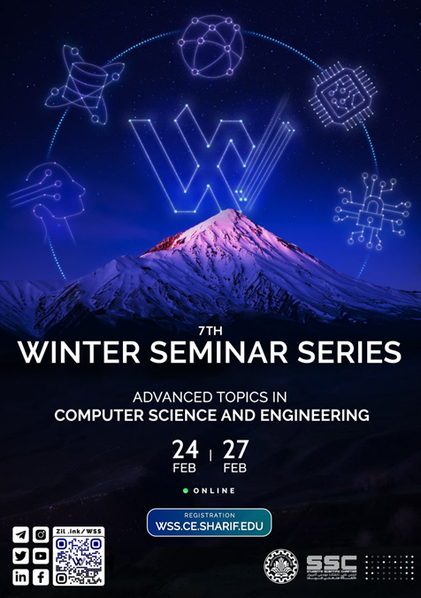

# Events-Information
## شناسنامه رویدادهای انجمن علمی دانشکده مهندسی کامپیوتر - دانشگاه صنعتی شریف

چرک نویس اولیه:
- https://github.com/SharifAIChallenge
- https://github.com/Winter-Seminar-Series

# اس‌اس‌سی چیست و کجاست؟

خیلی سال پیش، جمعی از بچه‌های **دانشکده مهندسی کامپیوتر شریف**، تصمیم گرفتند حرکت جدیدی را شروع کنند. به این ترتیب انجمن علمی و فوق‌برنامه‌ی دانشکده، (SSC: Student's Scientific Chapter) به وجود آمد. الان وقتی وارد لابی دانشکده می‌شوید و سرتون را به سمت چپ می‌چرخانید، یک اتاق با شیشه‌هایی بزرگ مشاهده می‌کنید که سمت چپش، اتاق SSC و سمت راستش اتاق شورای صنفی قرار دارد.

## هدف

هدف این بچه‌ها چه بود؟ آن‌ها می‌خواستند کارهایی مفید که جای‌شان در دانشکده خالی‌ست، در کنار درس‌های دانشگاه انجام دهند. هر کسی فکری در سر داشت و با پا گرفتن انجمن علمی، هر کدام از این فکرها به شکل‌های مختلفی عملی شدند.

### مثال‌های ایده‌های پیاده‌سازی شده:

- برگزاری کارگاه
- برگزاری مسابقه
- برگزاری جشن‌های مختلف
- راه‌انداختن نشریه‌ی دانشکده

هر کدام از بچه‌ها ایده‌ی فنی، علمی یا فرهنگی در سر داشتند و در فضا و بستر انجمن به آن‌ها می‌پرداختند.

  

از دل این ایده‌های علمی و فنی، یک سری برنامه و رویداد به وجود آمدند که برای اشاره به تعدادی از آن‌ها، می‌توان از این رویدادها نام برد:

- **مسابقه‌ی بین‌المللی Sharif AI Challenge**

تا امروز، ۱۴ دوره از آن برگزار شده و تا دوره‌ی هفتم اسمش Java Challenge بوده است. این مسابقه معمولا هر سال حوالی بهمن و اسفند برگزار می‌شود که تعداد زیادی شرکت‌کننده از مکان، دانشگاه‌ها و شهرهای مختلف دارد و برگزاری آن نیز کاملا توسط دانشجوهای دانشکده‌ی کامپیوتر شریف و همچنین بقیه‌ی دانشجوهای علاقه‌مند، و با کمک اجرایی، فنی، برندینگی و مدیریتی تعداد زیادی از آن‌ها انجام می‌شود.

  

- **مجموعه سمینارهای زمستانه‌ی مباحث پیشرفته در مهندسی و علوم کامپیوتر (WSS)**
  - قبلا در دو روز پشت‌ سر هم برگزار می‌شد
  - آخرین دوره در ۴ روز برگزار شد
  - تعداد زیادی دانشجو و محقق متبحر کامپیوتری در آن ارائه می‌دهند
  - هدف ارائه بروزترین دستاوردهای رشته به شرکت‌کننده‌ها

  

