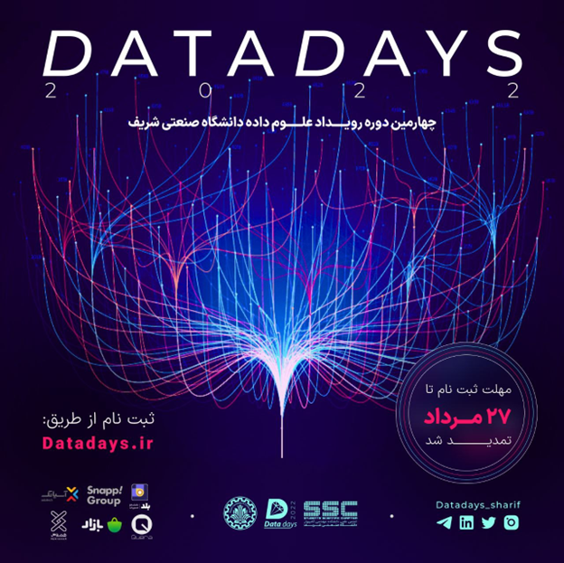
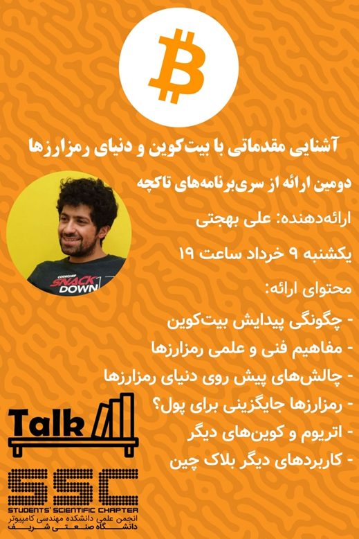
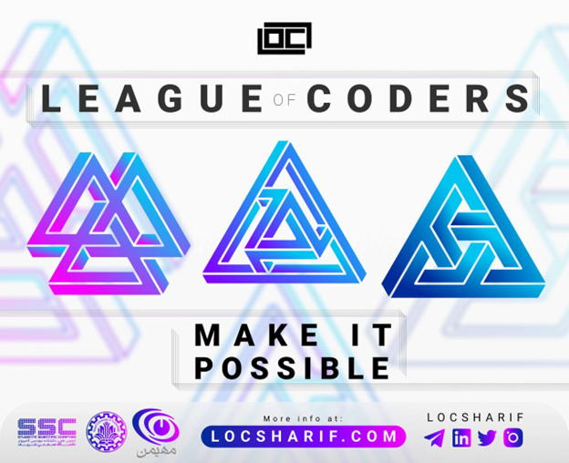
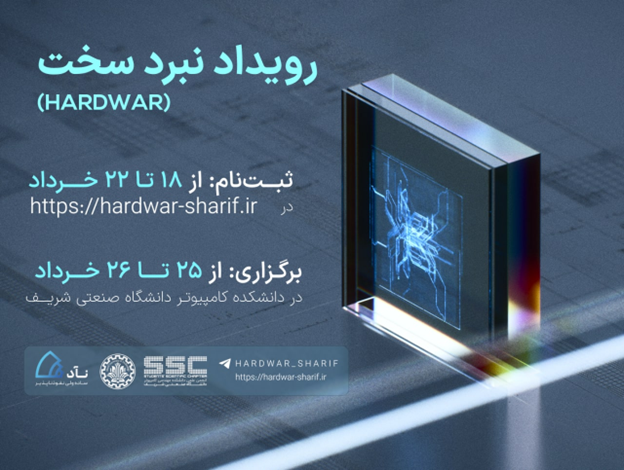
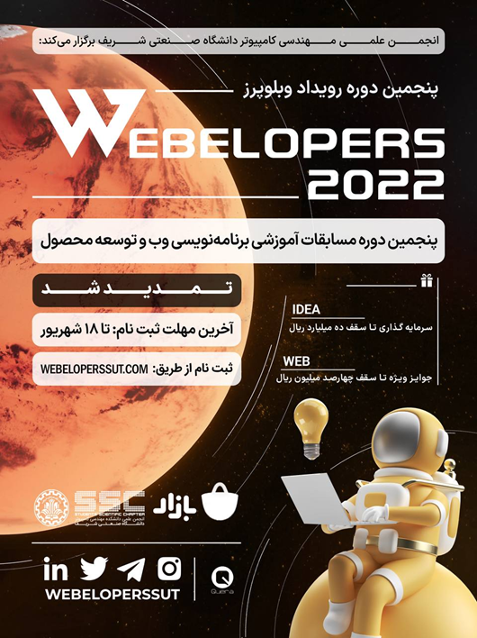
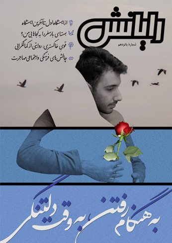
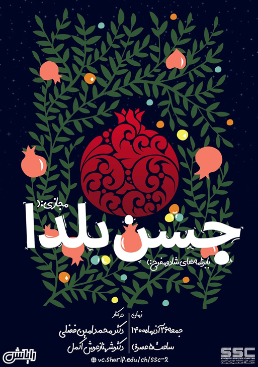

# Events-Information
## شناسنامه رویدادهای انجمن علمی دانشکده مهندسی کامپیوتر - دانشگاه صنعتی شریف

چرک نویس اولیه:
- https://github.com/SharifAIChallenge
- https://github.com/Winter-Seminar-Series

# اس‌اس‌سی چیست و کجاست؟

خیلی سال پیش، جمعی از بچه‌های **دانشکده مهندسی کامپیوتر شریف**، تصمیم گرفتند حرکت جدیدی را شروع کنند. به این ترتیب انجمن علمی و فوق‌برنامه‌ی دانشکده، (SSC: Student's Scientific Chapter) به وجود آمد. الان وقتی وارد لابی دانشکده می‌شوید و سرتون را به سمت چپ می‌چرخانید، یک اتاق با شیشه‌هایی بزرگ مشاهده می‌کنید که سمت چپش، اتاق SSC و سمت راستش اتاق شورای صنفی قرار دارد.

## هدف

هدف این بچه‌ها چه بود؟ آن‌ها می‌خواستند کارهایی مفید که جای‌شان در دانشکده خالی‌ست، در کنار درس‌های دانشگاه انجام دهند. هر کسی فکری در سر داشت و با پا گرفتن انجمن علمی، هر کدام از این فکرها به شکل‌های مختلفی عملی شدند.

### مثال‌های ایده‌های پیاده‌سازی شده:

- برگزاری کارگاه
- برگزاری مسابقه
- برگزاری جشن‌های مختلف
- راه‌انداختن نشریه‌ی دانشکده

هر کدام از بچه‌ها ایده‌ی فنی، علمی یا فرهنگی در سر داشتند و در فضا و بستر انجمن به آن‌ها می‌پرداختند.

  

از دل این ایده‌های علمی و فنی، یک سری برنامه و رویداد به وجود آمدند که برای اشاره به تعدادی از آن‌ها، می‌توان از این رویدادها نام برد:

- **مسابقه‌ی بین‌المللی Sharif AI Challenge**

تا امروز، ۱۴ دوره از آن برگزار شده و تا دوره‌ی هفتم اسمش Java Challenge بوده است. این مسابقه معمولا هر سال حوالی بهمن و اسفند برگزار می‌شود که تعداد زیادی شرکت‌کننده از مکان، دانشگاه‌ها و شهرهای مختلف دارد و برگزاری آن نیز کاملا توسط دانشجوهای دانشکده‌ی کامپیوتر شریف و همچنین بقیه‌ی دانشجوهای علاقه‌مند، و با کمک اجرایی، فنی، برندینگی و مدیریتی تعداد زیادی از آن‌ها انجام می‌شود.

  

- **مجموعه سمینارهای زمستانه‌ی مباحث پیشرفته در مهندسی و علوم کامپیوتر (WSS)**

قبلا در دو روز پشت‌ سر هم برگزار می‌شد و آخرین دوره در ۴ روز برگزار شد، و تعداد زیادی دانشجو و محقق متبحر کامپیوتری در آن در مورد بروزترین دستاوردهای این رشته برای تعداد زیادی شرکت‌کننده ارائه می‌دهند. این رویداد هم با مدیریت و اجرای دانشجوهای دانشکده برگزار می‌شود و تا این لحظه ۷ دوره از آن برگزار شده است و زمستان امسال، ۸امین دوره از آن برگزار خواهد شد.

  

- **مسابقه‌ی بین‌المللی DataDays**

امسال ۴امین دوره‌ی آن نیز در دست برگزاری قرار گرفت و هر سال نیز در بازه‌ی زمستانه،‌ برگزار می‌شود. در سال گذشته بیش از ۲۰۰۰ شرکت‌کننده در این رویداد مسابقه‌محور شرکت کردند و به حل سوالات مربوط به حوزه‌ی دیتا و ماشین‌لرنینگ پرداختند. این رویداد نیز توسط دانشجویان دانشکده‌ی کامپیوتر برگزار می‌شود و هر ساله آماده‌سازی رویداد بیش از ۵ ماه زمان نیاز دارد.

  

- **سلسله جلسات «تاکچه»**

یک برنامه‌ی بلند مدت می‌باشد و هدف آن جمع کردن بچه‌های علاقه‌مند به موضوعات علمی و فنی مشترک، دور هم است، و بخش زیادی از مخاطب اصلی آن، ورودی‌های جدید دانشکده می‌باشند.

  

- **مسابقه‌ی بین‌دانشگاهی League of Coders**

سال گذشته اولین دوره‌ی آن برگزار شد و هر ساله با جامعه مخاطب دانشجویان ترم ۲ای مهندسی کامپیوتر دانشگاه‌های کشور برگزار می‌شود و زبان اصلی برنامه‌نویسی آن جاوا می‌باشد و دانشجویان شرکت‌کنندگان در این رویداد، به حل سوالات برنامه‌نویسی با زبان جاوا می‌پردازند. این رویداد نیز توسط دانشجویان دانشکده کامپیوتر برگزار می‌شود و بازه‌ی برگزاری آن نیز، هر ساله پس از فروردین می‌باشد.

  

- **مسابقه‌-کارگاه سخت‌افزاری Hardwar**

امسال ۴امین دوره‌ی آن برگزار شد و هر ساله با جامعه مخاطب دانشجویان مهندسی کامپیوتر و مهندسی برق دانشگاه‌های کشور برگزار می‌شود و در آن به آموزش مباحث سخت‌افزاری به شیوه‌ی متفاوتی نسبت به دروس دانشگاهی پرداخته می‌شود و در نهایت شامل مسابقه نیز هست. این رویداد نیز توسط دانشجویان دانشکده مهندسی کامپیوتر و با کمک دانشجویان ارشد دانشکده، برگزار می‌شود.

  

- **مسابقه آموزشی Webelopers**

از بزرگترین رویدادهای دانشجویی کشور می باشد که پنجمین دوره آن در حال برگزاریست. تمرکز این رویداد بر حوزه‌های توسعه وب (شامل بخش های Frontend, Backend و DevOps) و خلق محصولات نوآورانه (innovative) بوده و با توجه به آموزشی بودن رویداد جامعه مخاطب بسیار گسترده ای را در بر می گیرد.

  

همچنین در کنار همه‌ی این رویداد و کارگاه‌های علمی-فنی، رویدادهای دیگه‌ای نیز برگزار می‌شوند که همه‌ی این‌ها برخواسته از خواست و دغدغه‌ی خود دانشجوهای دانشکده کامپیوتر می‌باشد و همه‌ی آن‌ها برنامه‌ریزی مشخصی دارند.

بُعد دیگری از کارهای SSC هم فعالیت‌های فرهنگی-اجتماعی این انجمن هستند که با هدف‌هایی مانند بیشتر شدن نشاط علمی و آگاهی بچه‌ها و شکل‌ گرفتن ارتباط موثر بین همه‌ی اعضای دانشکده، ایجاد شده‌اند و از جمله‌ی آن‌ها می‌توان به این موارد اشاره کرد:

- **نشریه‌ی «رایانش»**

رایانش بعد از طی فراز و فرودهایی در سال‌های اخیر، مجددا فعالیتش را از سر گرفته است. دفترش هم یک اتاق شیشه‌ای کوچک کنار آسانسورهای لابی دانشکده می‌باشد. رایانش جایی‌ست که فکر و حرفِ دل‌های همه‌ی اعضای دانشکده را منعکس می‌کند.

  

- **جشن‌ها**

جشن‌هایی مانند جشن عید، جشن یلدا و جشن ورودی‌ها هر ساله برگزار می‌شوند و برگزار کننده‌ی هر کدام از آن‌ها نیز، دانشجویان دانشکده و از سال‌های مختلف می‌باشند!

  

