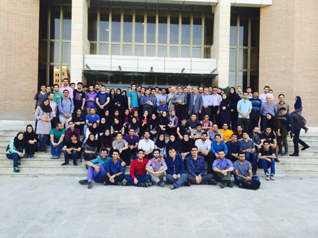
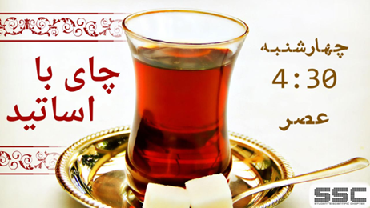

# Events-Information
## شناسنامه رویدادهای انجمن علمی دانشکده مهندسی کامپیوتر - دانشگاه صنعتی شریف

چرک نویس اولیه:
- https://github.com/SharifAIChallenge
- https://github.com/Winter-Seminar-Series

# اس‌اس‌سی چیست و کجاست؟

خیلی سال پیش، جمعی از بچه‌های **دانشکده مهندسی کامپیوتر شریف**، تصمیم گرفتند حرکت جدیدی را شروع کنند. به این ترتیب انجمن علمی و فوق‌برنامه‌ی دانشکده، (SSC: Student's Scientific Chapter) به وجود آمد. الان وقتی وارد لابی دانشکده می‌شوید و سرتون را به سمت چپ می‌چرخانید، یک اتاق با شیشه‌هایی بزرگ مشاهده می‌کنید که سمت چپش، اتاق SSC و سمت راستش اتاق شورای صنفی قرار دارد.

## هدف

هدف این بچه‌ها چه بود؟ آن‌ها می‌خواستند کارهایی مفید که جای‌شان در دانشکده خالی‌ست، در کنار درس‌های دانشگاه انجام دهند. هر کسی فکری در سر داشت و با پا گرفتن انجمن علمی، هر کدام از این فکرها به شکل‌های مختلفی عملی شدند.

### مثال‌های ایده‌های پیاده‌سازی شده:

- برگزاری کارگاه
- برگزاری مسابقه
- برگزاری جشن‌های مختلف
- راه‌انداختن نشریه‌ی دانشکده

هر کدام از بچه‌ها ایده‌ی فنی، علمی یا فرهنگی در سر داشتند و در فضا و بستر انجمن به آن‌ها می‌پرداختند.

  

از دل این ایده‌های علمی و فنی، یک سری برنامه و رویداد به وجود آمدند که برای اشاره به تعدادی از آن‌ها، می‌توان از این رویدادها نام برد:

- **مسابقه‌ی بین‌المللی Sharif AI Challenge**

تا امروز، ۱۴ دوره از آن برگزار شده و تا دوره‌ی هفتم اسمش Java Challenge بوده است. این مسابقه معمولا هر سال حوالی بهمن و اسفند برگزار می‌شود که تعداد زیادی شرکت‌کننده از مکان، دانشگاه‌ها و شهرهای مختلف دارد و برگزاری آن نیز کاملا توسط دانشجوهای دانشکده‌ی کامپیوتر شریف و همچنین بقیه‌ی دانشجوهای علاقه‌مند، و با کمک اجرایی، فنی، برندینگی و مدیریتی تعداد زیادی از آن‌ها انجام می‌شود.

  

- **مجموعه سمینارهای زمستانه‌ی مباحث پیشرفته در مهندسی و علوم کامپیوتر (WSS)**

قبلا در دو روز پشت‌ سر هم برگزار می‌شد و آخرین دوره در ۴ روز برگزار شد، و تعداد زیادی دانشجو و محقق متبحر کامپیوتری در آن در مورد بروزترین دستاوردهای این رشته برای تعداد زیادی شرکت‌کننده ارائه می‌دهند. این رویداد هم با مدیریت و اجرای دانشجوهای دانشکده برگزار می‌شود و تا این لحظه ۷ دوره از آن برگزار شده است و زمستان امسال، ۸امین دوره از آن برگزار خواهد شد.

  

- **مسابقه‌ی بین‌المللی DataDays**

امسال ۴امین دوره‌ی آن نیز در دست برگزاری قرار گرفت و هر سال نیز در بازه‌ی زمستانه،‌ برگزار می‌شود. در سال گذشته بیش از ۲۰۰۰ شرکت‌کننده در این رویداد مسابقه‌محور شرکت کردند و به حل سوالات مربوط به حوزه‌ی دیتا و ماشین‌لرنینگ پرداختند. این رویداد نیز توسط دانشجویان دانشکده‌ی کامپیوتر برگزار می‌شود و هر ساله آماده‌سازی رویداد بیش از ۵ ماه زمان نیاز دارد.

  

- **سلسله جلسات «تاکچه»**

یک برنامه‌ی بلند مدت می‌باشد و هدف آن جمع کردن بچه‌های علاقه‌مند به موضوعات علمی و فنی مشترک، دور هم است، و بخش زیادی از مخاطب اصلی آن، ورودی‌های جدید دانشکده می‌باشند.

  

- **مسابقه‌ی بین‌دانشگاهی League of Coders**

سال گذشته اولین دوره‌ی آن برگزار شد و هر ساله با جامعه مخاطب دانشجویان ترم ۲ای مهندسی کامپیوتر دانشگاه‌های کشور برگزار می‌شود و زبان اصلی برنامه‌نویسی آن جاوا می‌باشد و دانشجویان شرکت‌کنندگان در این رویداد، به حل سوالات برنامه‌نویسی با زبان جاوا می‌پردازند. این رویداد نیز توسط دانشجویان دانشکده کامپیوتر برگزار می‌شود و بازه‌ی برگزاری آن نیز، هر ساله پس از فروردین می‌باشد.

  

- **مسابقه‌-کارگاه سخت‌افزاری Hardwar**

امسال ۴امین دوره‌ی آن برگزار شد و هر ساله با جامعه مخاطب دانشجویان مهندسی کامپیوتر و مهندسی برق دانشگاه‌های کشور برگزار می‌شود و در آن به آموزش مباحث سخت‌افزاری به شیوه‌ی متفاوتی نسبت به دروس دانشگاهی پرداخته می‌شود و در نهایت شامل مسابقه نیز هست. این رویداد نیز توسط دانشجویان دانشکده مهندسی کامپیوتر و با کمک دانشجویان ارشد دانشکده، برگزار می‌شود.

  

- **مسابقه آموزشی Webelopers**

از بزرگترین رویدادهای دانشجویی کشور می باشد که پنجمین دوره آن در حال برگزاریست. تمرکز این رویداد بر حوزه‌های توسعه وب (شامل بخش های Frontend, Backend و DevOps) و خلق محصولات نوآورانه (innovative) بوده و با توجه به آموزشی بودن رویداد جامعه مخاطب بسیار گسترده ای را در بر می گیرد.

  

همچنین در کنار همه‌ی این رویداد و کارگاه‌های علمی-فنی، رویدادهای دیگه‌ای نیز برگزار می‌شوند که همه‌ی این‌ها برخواسته از خواست و دغدغه‌ی خود دانشجوهای دانشکده کامپیوتر می‌باشد و همه‌ی آن‌ها برنامه‌ریزی مشخصی دارند.

بُعد دیگری از کارهای SSC هم فعالیت‌های فرهنگی-اجتماعی این انجمن هستند که با هدف‌هایی مانند بیشتر شدن نشاط علمی و آگاهی بچه‌ها و شکل‌ گرفتن ارتباط موثر بین همه‌ی اعضای دانشکده، ایجاد شده‌اند و از جمله‌ی آن‌ها می‌توان به این موارد اشاره کرد:

- **نشریه‌ی «رایانش»**

رایانش بعد از طی فراز و فرودهایی در سال‌های اخیر، مجددا فعالیتش را از سر گرفته است. دفترش هم یک اتاق شیشه‌ای کوچک کنار آسانسورهای لابی دانشکده می‌باشد. رایانش جایی‌ست که فکر و حرفِ دل‌های همه‌ی اعضای دانشکده را منعکس می‌کند.

  

- **جشن‌ها**

جشن‌هایی مانند جشن عید، جشن یلدا و جشن ورودی‌ها هر ساله برگزار می‌شوند و برگزار کننده‌ی هر کدام از آن‌ها نیز، دانشجویان دانشکده و از سال‌های مختلف می‌باشند!

  

- **چای با اساتید و یاد استاد**

برنامه‌هایی مثل «چای با اساتید» که هر از چند گاهی در لابی دانشکده با حضور اساتید دانشکده و دانشجوها برگزار می‌شوند و دریچه‌ای برای گفت‌وگوی بیشتر بین آن‌ها هست. علاوه بر این، جشن «یاد استاد» هر سال حوالی روز معلم برای بزرگداشت زحمات اساتید با حضور پرشور اساتید و دانشجوها برگزار می‌شود.

  

  

- **نیازها**

انجمن علمی برای برگزاری همه‌ی این برنامه‌ها، جشن‌ها و رویدادها، به بودجه‌ای مالی و همچنین سیستم‌های زیرساختی نیاز دارد.

هر کدام از این برنامه و رویدادها، سایتی دارند و شرکت‌کنندگان در سایت ارتباط می‌گیرند با برگزارکنندگان؛ برای مثال سابمیت کد رویداد AI Challenge در خود سایتش صورت می‌پذیرد و نیاز به سرور مجازی، دامین و VPS دارد.

همچنین برای برنامه‌های منابع انسانی و همچنین برگزاری حضوری رویدادها نیز نیاز به بودجه‌ای مالی حس می‌شود و این مورد نیز باید قبل از رویداد تامین شود.

# تیم برگزاری رویدادها

- **تیم علمی**
  - طرح مسابقه و سوالات رویدادها به بهترین شکل ممکن و با بروزترین محتواهای آموزشی هم‌سطح با آموزش دانشگاه‌های برتر جهان
  - برگزاری کارگاه‌هایی برای بهبود تسلط دانشجویان بر مباحث مدنظر رویداد
  - هماهنگی با ارائه‌دهندگان مسلط در حوزه‌‌های علوم کامپیوتر مدنظر رویدادها برای برگزاری ارائه‌هایی مضاف بر برنامه‌های قبلی
- **تیم برندینگ**
  - معرفی و پروموت برند رویداد و انجمن علمی مهندسی کامپیوتر شریف
  - جذب حداکثری مخاطبان متناسب با دوره
  - مدیریت بیش از ۶ شبکه‌ی اجتماعی و پشتیبانی و پاسخ‌گویی به سوالات مخاطبان
- **تیم اسپانسرشیپ**
  - تامین مالی رویداد
  - جذب شرکت‌های برتر مهندسی نرم‌افزار برای حضور و همراهی و استخدام شرکت‌کنندگان دوره
- **تیم فنی**
  - طراحی و پشتیبانی فنی سایت مربوط به رویداد

# مخاطبان رویدادها

دانشجویان و علاقه‌مندان به آموزش و یادگیری مباحث مهندسی نرم‌افزار، سخت‌افزار، علوم کامپیوتر و فیلدهای متفاوت درسی مهندسی کامپیوتر و با هدف استخدام در شرکت‌های حوزه‌های مهندسی کامپیوتر

خلاصه‌ی کلام این‌که همه‌ی این حرفا رو گفتیم تا به این برسیم که دانشکده خونه‌ی دوم همه‌ی ماست. جایی که حداقل چهار سال قراره بخش قابل توجهی از عمرمون رو توش سپری کنیم و رشد و بهتر شدن این خونه، فقط و فقط با کمک و همراهی همه‌ی ما دانشجوهای دانشکده ممکنه. 

اس‌اس‌سی جایی هست که دور هم جمع میشیم تا این خونه رو بهترش کنیم. جایی که هممون عضوش هستیم و با حضور همه‌ی ما هویت پیدا میکنه. به خصوص با حضور شما. هر سال هم حوالی خرداد همه‌ی بچه‌های دانشکده جمع می‌شن و با رای خودشون ۹ نفر از بین خودشون رو به مدت یه سال به عنوان شورای مرکزی انجمن علمی انتخاب می‌کنن.

SSC بستریه که توش می‌تونیم خیلی از ایده‌هامون رو عملی کنیم. جایی که کلی چیز برای یاد گرفتن، کلی کار برای انجام دادن، کلی آدم جدید برای شناختن، کلی مسئولیت برای برعهده‌گرفتن و کلی چیز جذاب و مفید دیگه برای رشد دانشکده داره. ما بی‌صبرانه منتظریم تا شما رو در دانشکده‌ی مهندسی کامپیوتر ملاقات کنیم. :)

  

